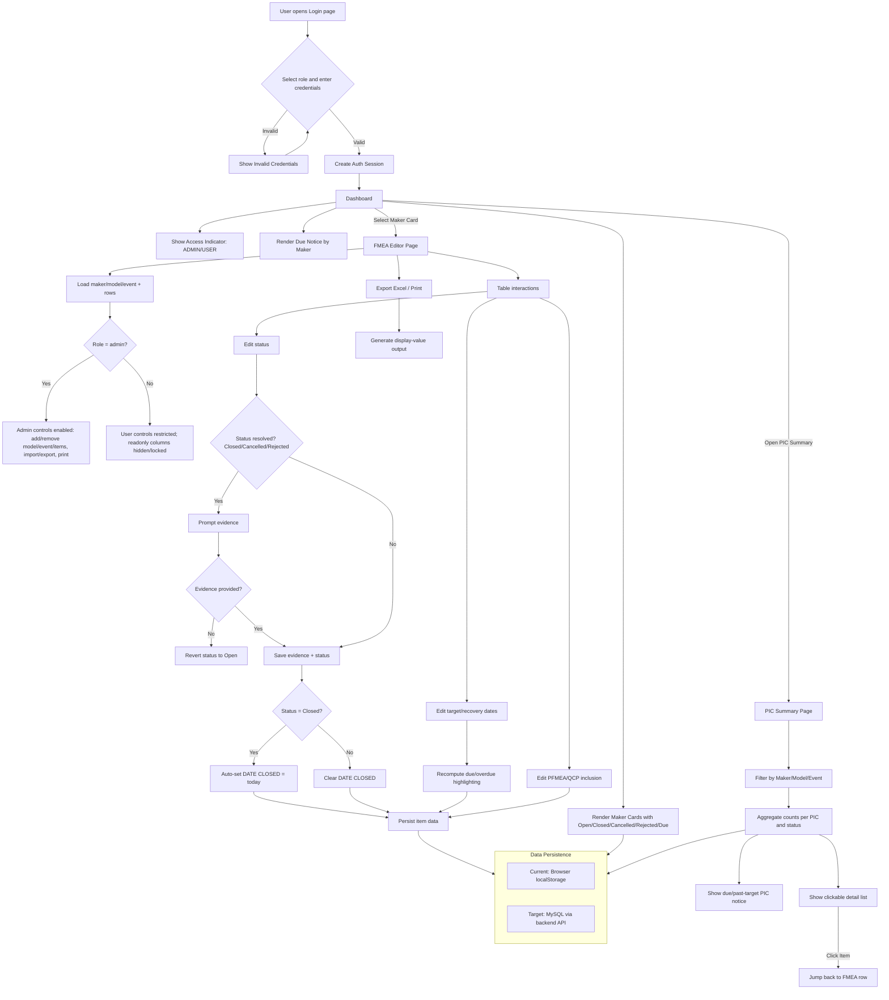

# Mixsched System Flowchart (End-to-End)

```mermaid
flowchart TD
    A[User opens Login page] --> B{Select role and enter credentials}
    B -->|Invalid| C[Show Invalid Credentials]
    C --> B
    B -->|Valid| D[Create Auth Session]

    D --> E[Dashboard]
    E --> E1[Show Access Indicator: ADMIN/USER]
    E --> E2[Render Maker Cards with Open/Closed/Cancelled/Rejected/Due]
    E --> E3[Render Due Notice by Maker]

    E -->|Select Maker Card| F[FMEA Editor Page]
    E -->|Open PIC Summary| G[PIC Summary Page]

    %% FMEA
    F --> F0[Load maker/model/event + rows]
    F0 --> F1{Role = admin?}
    F1 -->|Yes| F2[Admin controls enabled: add/remove model/event/items, import/export, print]
    F1 -->|No| F3[User controls restricted; readonly columns hidden/locked]

    F --> F4[Table interactions]
    F4 --> F5[Edit status]
    F5 --> F6{Status resolved? Closed/Cancelled/Rejected}
    F6 -->|Yes| F7[Prompt evidence]
    F7 --> F8{Evidence provided?}
    F8 -->|No| F9[Revert status to Open]
    F8 -->|Yes| F10[Save evidence + status]
    F6 -->|No| F10

    F10 --> F11{Status = Closed?}
    F11 -->|Yes| F12[Auto-set DATE CLOSED = today]
    F11 -->|No| F13[Clear DATE CLOSED]

    F12 --> F14[Persist item data]
    F13 --> F14

    F4 --> F15[Edit target/recovery dates]
    F15 --> F16[Recompute due/overdue highlighting]
    F16 --> F14

    F4 --> F17[Edit PFMEA/QCP inclusion]
    F17 --> F14

    F --> F18[Export Excel / Print]
    F18 --> F19[Generate display-value output]

    %% PIC Summary
    G --> G1[Filter by Maker/Model/Event]
    G1 --> G2[Aggregate counts per PIC and status]
    G2 --> G3[Show due/past-target PIC notice]
    G2 --> G4[Show clickable detail list]
    G4 -->|Click Item| G5[Jump back to FMEA row]

    %% Data Layer (current + target)
    subgraph H[Data Persistence]
      H1[Current: Browser localStorage]
      H2[Target: MySQL via backend API]
    end

    F14 --> H
    E2 --> H
    G2 --> H
```
